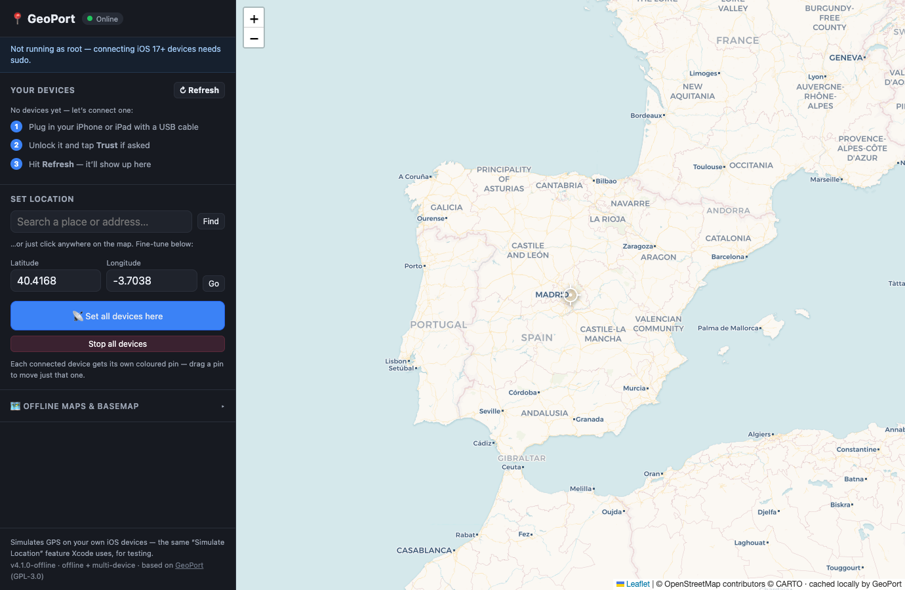

# betterGeoPort

An **iOS location simulator**: set a simulated GPS location on your own iPhone or
iPad straight from a map — the same "Simulate Location" mechanism Xcode uses, for
app testing and development.

**betterGeoPort** is a rebuild of [**GeoPort** by davesc63](https://github.com/davesc63/GeoPort)
(GPL-3.0) focused on three things:

- 🗺️ **Offline maps** — map tiles are served from a local cache, so the map works
  with no internet. Tiles cache automatically as you browse, and you can
  pre-download a whole region for guaranteed-offline use in the field.
- 📱 **Multi-device** — connect several devices at once. Each gets its own movable
  pin, plus a **“Set all devices here”** button to drop them all on one spot.
- 🔒 **Privacy / offline-first** — no analytics or telemetry, binds to `127.0.0.1`
  only, validates the `Host` header, and never blocks startup on the network.



> ⚠️ Use this only on **your own devices**, for legitimate testing. It relies on
> Apple's developer "Simulate Location" feature and requires the device to be
> unlocked, trusted, and in Developer Mode.

---

## Install

betterGeoPort talks to iOS devices via [`pymobiledevice3`](https://github.com/doronz88/pymobiledevice3)
and needs to compile one native module, so the simplest path is to build from
source. macOS only.

### 1. Prerequisites

- macOS (Apple Silicon or Intel), Python **3.11–3.13**
- Xcode command-line tools and Homebrew OpenSSL (for the tunnel stack):

```bash
xcode-select --install
brew install openssl@3
```

### 2. Set up

```bash
git clone https://github.com/Kyomte/betterGeoPort.git
cd betterGeoPort

python3 -m venv .venv && source .venv/bin/activate

# point the build at Apple clang + Homebrew OpenSSL (needed for sslpsk-pmd3)
export SDKROOT="$(xcrun --show-sdk-path)" CC=/usr/bin/clang
export CFLAGS="-I$(brew --prefix openssl@3)/include"
export LDFLAGS="-L$(brew --prefix openssl@3)/lib"

pip install -r requirements.txt
```

### 3. (optional) Build the .app

```bash
pip install pyinstaller
./packaging/build_app.sh        # produces ./betterGeoPort.app (ad-hoc signed)
```

---

## How to use

iOS 17+ location tunnels require **root**, so run with `sudo`:

```bash
sudo ./run --no-browser --port 54321
# then open http://localhost:54321
```

…or just launch **`betterGeoPort.app`** (it prompts for your admin password and opens
the browser for you).

Then:

1. **On the device:** enable Developer Mode (*Settings → Privacy & Security →
   Developer Mode*), connect it by USB, unlock it, and tap **Trust**.
2. **In GeoPort:** press **Refresh** → your device appears under *Your devices*.
   Pick **USB** or **Wi-Fi**, then **Connect**.
3. **Set a location:** click anywhere on the map (or search an address / type
   coordinates), then **Set here** on the device. Its blue dot in Apple Maps
   jumps there. Drag the coloured pin to move it live.
4. **Multiple devices:** connect several, then **📡 Set all devices here** to put
   them all on one point, or move each pin independently.
5. **Stop:** **Stop** (one device) or **Stop all** clears the simulation.

### Wi-Fi vs USB

USB always works. **Wi-Fi** works once macOS has registered the device as a
network device — automatic once a device stays on the same Wi-Fi with *“Show
this device when on Wi-Fi”* enabled in Finder. (See
[`NOTES_IPAD_WIFI.md`](../../tree/ipad-wifi-fix/NOTES_IPAD_WIFI.md) on the
`ipad-wifi-fix` branch for the deep dive on devices macOS is slow to register.)

### Offline maps

- Tiles cache automatically to `~/GeoPort/tiles` as you pan/zoom while online.
- Open **Offline maps & basemap** → pick a zoom range → **Download this area** to
  pre-fetch the current view for later offline use.
- The online/offline badge (top-left) reflects connectivity; cached areas keep
  working with no internet. *Tile usage is subject to each provider's policy —
  keep downloads modest.*

---

## How it works

| File | Purpose |
|------|---------|
| `main.py` | Flask app: routes, device listing, lifecycle, `Host` guard |
| `device_manager.py` | Per-device sessions — tunnels + independent location threads |
| `tiles.py` | Offline tile cache, area pre-download, cache management |
| `templates/map.html` | Single-page UI (vendored Leaflet, **no CDNs**) |
| `static/vendor/leaflet/` | Vendored Leaflet so the UI loads offline |
| `packaging/` | `Info.plist`, root-elevating launcher, `build_app.sh` |

The location tunnel uses pymobiledevice3's lockdown `CoreDeviceTunnelProxy` (TCP
tunnel) for iOS 17.4+ and the RSD/QUIC path for 17.0–17.3.

## Security notes

This is an unauthenticated HTTP server that controls devices and runs as **root**,
so it is deliberately hardened:

- binds to `127.0.0.1` only; rejects non-local `Host` headers (anti DNS-rebinding)
- tile providers are whitelisted (no open proxy / SSRF); cache paths are validated
- no telemetry, no third-party IP geolocation

Still, only run it on a machine you trust, and prefer USB on untrusted networks.

## License

GPL-3.0 — see [`LICENSE`](LICENSE). This is a derivative work of
[GeoPort by davesc63](https://github.com/davesc63/GeoPort); all credit for the
original to its author.
