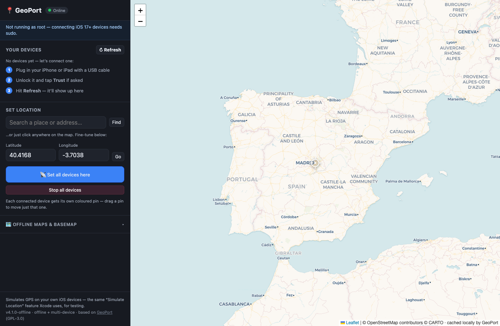

# betterGeoPort

An **iOS location simulator**: set a simulated GPS location on your own iPhone or
iPad straight from a map — the same "Simulate Location" mechanism Xcode uses, for
app testing and development.

**betterGeoPort** is a rebuild of [**GeoPort** by davesc63](https://github.com/davesc63/GeoPort)
(GPL-3.0) focused on three things:

- 🗺️ **Offline maps** — map tiles are served from a local cache, so the map works
  with no internet. Tiles cache automatically as you browse, and you can
  pre-download a whole region for guaranteed-offline use in the field.
- 📱 **Multi-device** — connect several devices at once. Each gets its own movable
  pin, plus a **“Set all devices here”** button to drop them all on one spot.
- 🔒 **Privacy / offline-first** — no analytics or telemetry, binds to `127.0.0.1`
  only, validates the `Host` header, and never blocks startup on the network.



> ⚠️ Use this only on **your own devices**, for legitimate testing. It relies on
> Apple's developer "Simulate Location" feature and requires the device to be
> unlocked, trusted, and in Developer Mode.

---

## Install

betterGeoPort talks to iOS devices via [`pymobiledevice3`](https://github.com/doronz88/pymobiledevice3)
and runs on **macOS** and **Windows 10/11**. The simplest path is to build from source.

- [macOS](#macos)
- [Windows](#windows)

### macOS

#### 1. Prerequisites

- macOS (Apple Silicon or Intel), Python **3.11–3.13**
- Xcode command-line tools and Homebrew OpenSSL (for the tunnel stack):

```bash
xcode-select --install
brew install openssl@3
```

#### 2. Set up

```bash
git clone https://github.com/Kyomte/betterGeoPort.git
cd betterGeoPort

python3 -m venv .venv && source .venv/bin/activate

# point the build at Apple clang + Homebrew OpenSSL (needed for sslpsk-pmd3)
export SDKROOT="$(xcrun --show-sdk-path)" CC=/usr/bin/clang
export CFLAGS="-I$(brew --prefix openssl@3)/include"
export LDFLAGS="-L$(brew --prefix openssl@3)/lib"

pip install -r requirements.txt
```

#### 3. (optional) Build the .app

```bash
pip install pyinstaller
./packaging/build_app.sh        # produces ./betterGeoPort.app (ad-hoc signed)
```

### Windows

#### 1. Prerequisites

- Windows 10 or 11 (x64), Python **3.11 or 3.12** from [python.org](https://www.python.org/downloads/windows/)
  (3.13 doesn't work yet: one dependency, `sslpsk-pmd3`, has no Windows build for it)
- **Apple Devices** from the Microsoft Store, or **iTunes**. This installs *Apple Mobile
  Device Service*, which Windows needs to talk to an iPhone/iPad.
- No compiler is needed: every native dependency ships a prebuilt Windows wheel.

#### 2. Set up

```powershell
git clone https://github.com/Kyomte/betterGeoPort.git
cd betterGeoPort

py -3.12 -m venv .venv
.venv\Scripts\pip install -r requirements.txt
```

#### 3. (optional) Build the .exe

```powershell
.venv\Scripts\pip install pyinstaller
powershell -ExecutionPolicy Bypass -File packaging\build_windows.ps1
```

This produces `dist\betterGeoPort\betterGeoPort.exe`, plus `betterGeoPort-windows-x64.zip`
to share. The exe isn't code-signed, so SmartScreen may warn on first launch
(*More info → Run anyway*).

---

## How to use

iOS 17+ location tunnels need **root / Administrator**.

**macOS:** run with `sudo`:

```bash
sudo ./run --no-browser --port 54321
# then open http://localhost:54321
```

…or just launch **`betterGeoPort.app`** (it prompts for your admin password and opens
the browser for you).

**Windows:** double-click **`run.bat`**, or **`betterGeoPort.exe`** if you built it, and
accept the UAC prompt. Your browser opens on `http://localhost:54321`. Keep the
console window open while you use it; closing it quits betterGeoPort.

```powershell
.\run.bat                         # same flags as macOS, e.g. --no-browser --port 54321
```

A banner at the top of the page tells you if something is missing, such as no
Administrator rights or no Apple Mobile Device Service.

Then:

1. **On the device:** enable Developer Mode (*Settings → Privacy & Security →
   Developer Mode*), connect it by USB, unlock it, and tap **Trust**.
2. **In betterGeoPort:** press **Refresh** → your device appears under *Your devices*.
   Pick **USB** or **Wi-Fi**, then **Connect**.
3. **Set a location:** click anywhere on the map (or search an address / type
   coordinates), then **Set here** on the device. Its blue dot in Apple Maps
   jumps there. Drag the coloured pin to move it live.
4. **Multiple devices:** connect several, then **📡 Set all devices here** to put
   them all on one point, or move each pin independently.
5. **Saved locations:** **☆ Save** keeps up to 5 named spots under *Set location*;
   click one to jump back to it. They're stored only in your browser's local
   storage, never on the server or in the repo, and they persist across restarts.
   The storage is tied to the page's address (`http://localhost:54321`), so if you
   launch betterGeoPort while it's already running, it reopens that address
   instead of starting a second copy on another port.
6. **Back to the real location:** **↩ Real location** (one device) or **↩ All devices
   back to real location** stops the simulation, and only reports success once the
   device confirms it. If the connection dropped, it reconnects first. The button is
   also there when a device isn't connected, so a device left on a fake location
   (say, after a crash) can be put back without restarting it. **Disconnect** and
   quitting betterGeoPort put connected devices back too: closing its console
   window or Ctrl+C on Windows; quitting (or force-quitting) the app, Ctrl+C, or
   closing the Terminal window on macOS. Without one of these, iOS keeps the
   simulated location until the device restarts.

### Wi-Fi vs USB

USB always works. **Wi-Fi** works once the OS has registered the device as a
network device:

- **macOS:** this happens automatically once a device stays on the same Wi-Fi with
  *“Show this device when on Wi-Fi”* enabled in Finder. (See
  [`NOTES_IPAD_WIFI.md`](../../tree/ipad-wifi-fix/NOTES_IPAD_WIFI.md) on the
  `ipad-wifi-fix` branch for the deep dive on devices macOS is slow to register.)
- **Windows:** connect the device once by USB and turn on Wi-Fi sync for it in the
  Apple Devices app (*“Sync with this device over Wi-Fi”* in iTunes). Then keep it
  awake on the same network.
- **Both:** on the iPhone/iPad, turn **Private Wi-Fi Address** **Off** for that network
  (*Settings → Wi-Fi → ⓘ*). With it on, the device appears under a randomised
  address, so the computer can't recognise it as the device it paired with and
  never offers Wi-Fi. "Fixed" and "Rotating" are still randomised, so it must be
  Off, and it's a per-network setting.

### Offline maps

- Tiles cache automatically to `~/GeoPort/tiles` (`%USERPROFILE%\GeoPort\tiles` on
  Windows) as you pan/zoom while online.
- Open **Offline maps & basemap** → pick a zoom range → **Download this area** to
  pre-fetch the current view for later offline use.
- **Carto basemaps (Streets / Light / Dark) need a free API key**, or every tile shows
  an "API key required" watermark. Request one at
  [carto.com/basemaps/apikey](https://carto.com/basemaps/apikey), then put it in
  `~/GeoPort/config.json` (`%USERPROFILE%\GeoPort\config.json` on Windows):

  ```json
  { "carto_api_key": "YOUR_KEY" }
  ```

  You can also set it in the `CARTO_API_KEY` environment variable. The key only goes
  to Carto's servers, never to the browser. Changes apply without a restart, but
  clear the cache (Offline maps → *Clear cache*) to drop any watermark tiles
  saved before the key was added.
- The online/offline badge (top-left) reflects connectivity; cached areas keep
  working with no internet. *Tile usage is subject to each provider's policy —
  keep downloads modest.*

---

## How it works

| File | Purpose |
|------|---------|
| `main.py` | Flask app: routes, device listing, lifecycle, `Host` guard |
| `device_manager.py` | Per-device sessions — tunnels + independent location threads |
| `tiles.py` | Offline tile cache, area pre-download, cache management |
| `templates/map.html` | Single-page UI (vendored Leaflet, **no CDNs**) |
| `static/vendor/leaflet/` | Vendored Leaflet so the UI loads offline |
| `packaging/` | macOS: `Info.plist`, root-elevating launcher, `build_app.sh`; Windows: `build_windows.ps1`, `AppIcon.ico` |
| `run` / `run.bat` | Run-from-source launchers (macOS / Windows) |
| `test_smoke.py`, `test_multidevice.py` | Hardware-free tests; CI runs them on macOS and Windows and launches the packaged app (`.github/workflows/ci.yml`) |

The location tunnel uses pymobiledevice3's lockdown `CoreDeviceTunnelProxy` (TCP
tunnel) for iOS 17.4+ and the RSD/QUIC path for 17.0–17.3. On Windows the tunnel's
virtual network adapter is [Wintun](https://www.wintun.net/), which ships inside
`pytun-pmd3`. Creating that adapter is why Administrator rights are needed.

## Security notes

This is an unauthenticated HTTP server that controls devices and runs as **root**
(macOS) or **Administrator** (Windows), so it is deliberately hardened:

- binds to `127.0.0.1` only; rejects non-local `Host` headers (anti DNS-rebinding)
- tile providers are whitelisted (no open proxy / SSRF); cache paths are validated
- no telemetry, no third-party IP geolocation

Still, only run it on a machine you trust, and prefer USB on untrusted networks.

## License

GPL-3.0 — see [`LICENSE`](LICENSE). This is a derivative work of
[GeoPort by davesc63](https://github.com/davesc63/GeoPort); all credit for the
original to its author.
